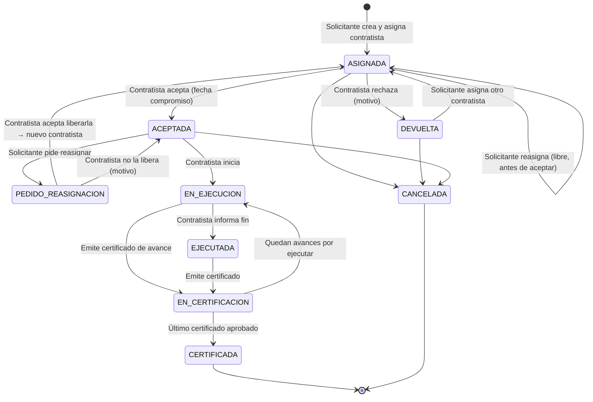
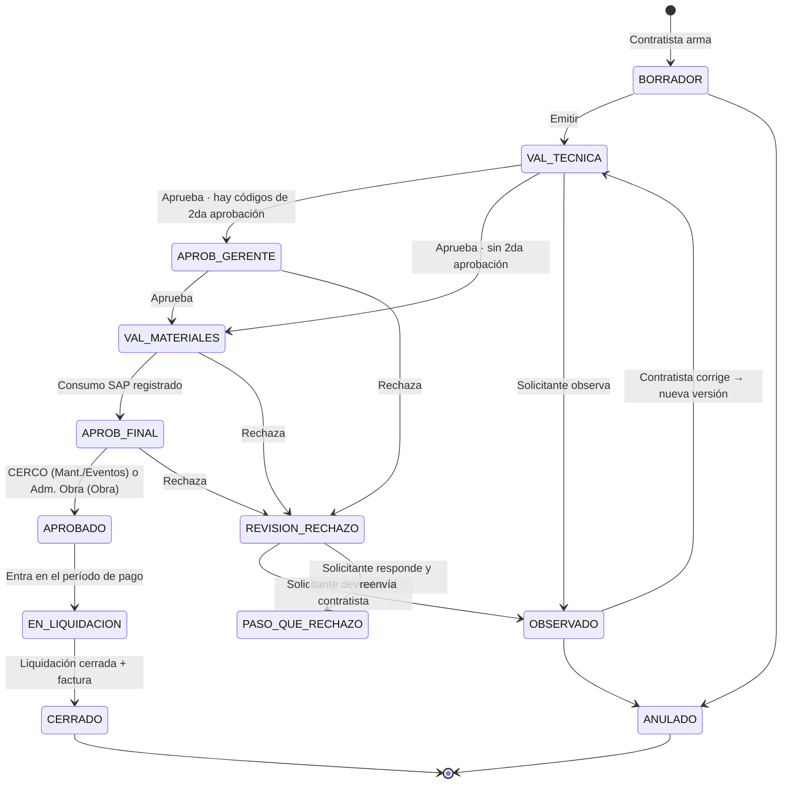
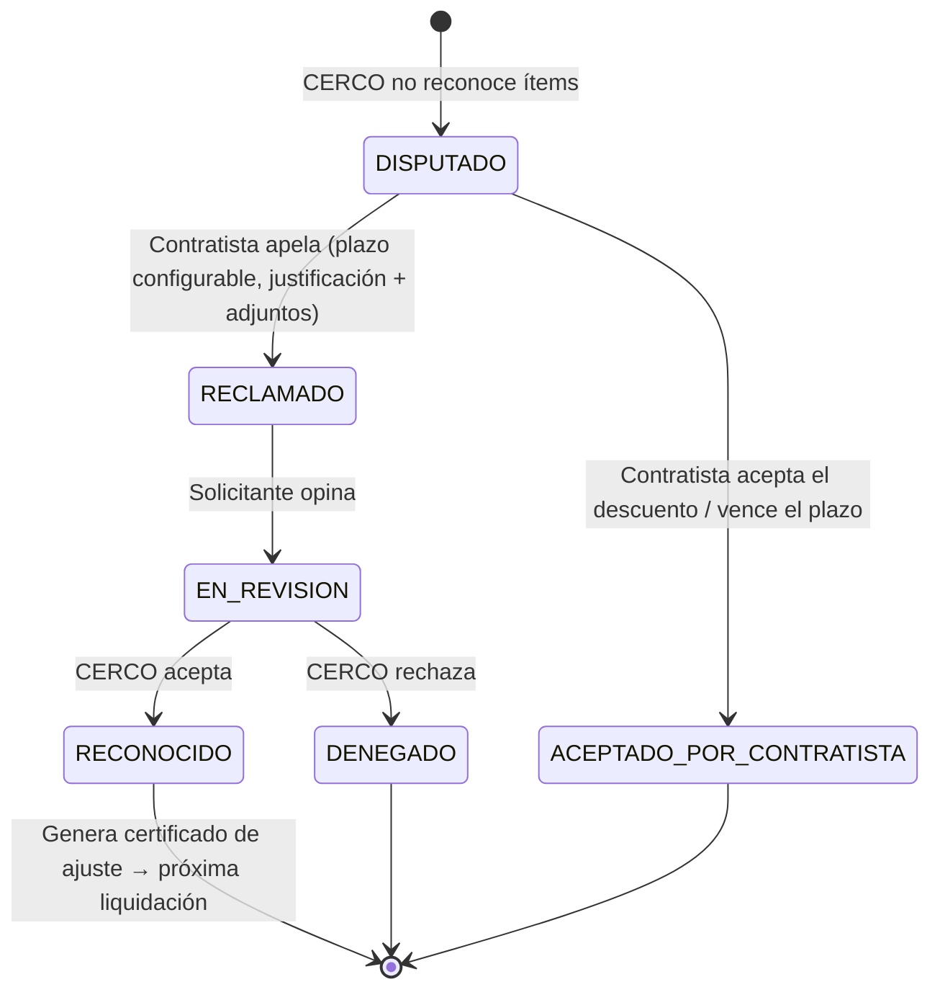

# 03 — Ciclo de vida

Hay **tres ciclos** encadenados:

1. **Tarea**: del pedido a la ejecución terminada.
2. **Certificado**: de la emisión a la aprobación final. Una tarea puede tener **uno o varios** certificados.
3. **Liquidación**: agrupa por contratista los certificados aprobados de un **período de pago**, congela precios y se cierra con la factura.

Lo que sigue es el **flujo estándar** (versión 1). Todo es configurable según 04.

---

## 1. Ciclo de la tarea

### Asignación y reasignación

| Situación | Regla |
|---|---|
| Asignada, no aceptada | El solicitante puede **reasignar libremente** a otro contratista (con motivo). |
| El contratista la **rechaza** | Vuelve al solicitante (DEVUELTA) y **sale de la bandeja** del contratista. El solicitante asigna otro. |
| Ya aceptada | Reasignar requiere que el **contratista actual acepte liberarla**. Evita que alguien pierda una tarea que ya estaba organizando sin enterarse. |
| En ejecución o ejecutada | **No se puede reasignar.** |

Solo pueden pedir tareas usuarios internos con rol solicitante (técnicos, inspectores, supervisores, analistas), eligiendo entre contratistas habilitados en la subregión de la tarea.

### Datos del pedido

- **Tipo de trabajo**: Mantenimiento / Eventos / Obra. Define columna de precio, aprobador final y campos adicionales.
- Subtipo (ej. mantenimiento correctivo, preventivo, siniestro, edificios), tipo de red, nº de siniestro, proyecto, etapa, etc. según el tipo (ver 05 y 10).
- Título, descripción, región / subregión / base, dirección.
- Prioridad y **fecha requerida** (base del SLA).
- Contratista asignado.
- **Imputación** (WO, PEP u orden de controlling). **La define el solicitante** (ver 06).
- Gerente para 2da aprobación: por defecto el de la subregión; el solicitante puede elegir otro.
- **Cantidad prevista de certificados** (por defecto 1). Editable antes o después de certificar.
- Documentación inicial.

### Durante la ejecución

- El contratista carga **avances** (comentarios, fotos, archivos) que después puede usar como documentación del certificado.
- Tarea y contratista tienen un **hilo de mensajes** propio (reemplaza los mails).

---

## 2. Varios certificados por tarea (avances)

- La tarea declara **cuántos certificados se esperan** (ej.: una obra en 4 avances). Se puede corregir en cualquier momento, con registro.
- Cada certificado se identifica como **"2 de 4"** y se marca si es el **final**.
- La tarea queda CERTIFICADA cuando el certificado final queda aprobado.
- Esto permite ver en una sola tarea **todo lo que se pagó por ella**, cuánto falta y cómo evolucionó.

---

## 3. Ciclo del certificado

### Estados

| Estado | Tiene la pelota | Qué hace |
|---|---|---|
| **BORRADOR** | Contratista | Arma carátula, MO, materiales, recuperados y documentos. |
| **VAL_TECNICA** | Solicitante | Valida trabajo, MO, materiales, recuperados **y que la documentación sea suficiente**. |
| **APROB_GERENTE** | Gerente elegido | 2da aprobación, solo si aplica. |
| **VAL_MATERIALES** | Administración | Valida **solo materiales**; descarga el reporte; consume en SAP; registra el documento SAP. |
| **APROB_FINAL** | CERCO (Mant./Eventos) o Adm. Obra (Obra) | Control final: documentación, alcance de los códigos, montos. |
| **APROBADO** | — | Listo para pago; espera el cierre del período. |
| **EN_LIQUIDACION** | Administración / Contratista | Incluido en la liquidación del período (ver §5). |
| **CERRADO** | — | Precio congelado y factura adjunta. Final. |
| **OBSERVADO** | Contratista | Corrige (nueva versión) o anula. |
| **REVISION_RECHAZO** | Solicitante | Un aprobador posterior rechazó; decide. |
| **ANULADO** | — | Final, con motivo. |

### 2da aprobación

Pasa por el gerente si el certificado incluye **algún código marcado "requiere 2da aprobación"** (costo mínimo diario, adicionales, recursos solicitados, etc.). **No depende del monto.** La marca se mantiene en el catálogo (06).

### Imputación

La define el solicitante al crear la tarea. El solicitante (y Administración) **pueden cambiarla hasta VAL_MATERIALES inclusive**; después queda fija. El cambio no afecta al contratista y queda auditado.

---

## 4. Rechazos cruzados

Todo rechazo lleva **motivo** y puede marcar **ítems puntuales** (una línea de MO, un material, un documento faltante).

| Quién rechaza | Va a | Opciones del que recibe |
|---|---|---|
| Solicitante | Contratista → OBSERVADO | Corregir (nueva versión) o anular |
| Gerente, Administración, CERCO, Adm. Obra | **Solicitante** → REVISION_RECHAZO | a) **Responder y reenviar** al paso que rechazó sin cambiar el contenido. b) **Devolver al contratista** |

- **Reenviar sin cambios**: vuelve directo al paso que rechazó; las aprobaciones previas siguen valiendo.
- **Devolver al contratista**: nueva versión. Al emitirla **se reinicia desde VAL_TECNICA** y cada aprobador ve las **diferencias** contra lo que ya había visto.
- El contratista ve todo el hilo de observaciones.

---

## 5. Liquidación, precios y cierre

**Regla de precio:** un certificado se paga con la **LPU vigente al cierre del período de pago**, no con la de la emisión. Ejemplo: el período cierra el 20; hay un certificado aprobado esperando pago; el 18 se publica una LPU nueva → se paga con la nueva.

1. **Mientras no está cerrado**, el certificado se **revaloriza** automáticamente cada vez que se publica una LPU. Las cantidades no cambian, así que **las aprobaciones siguen valiendo**. Queda registrado cada cambio de importe.
2. En la **fecha de corte** del período, Administración genera la **liquidación** por contratista: toma los certificados APROBADO, **congela precios** y calcula el total.
3. El contratista adjunta la **factura** (y quien corresponda, los datos de compras: HES, OC, etc.).
4. Con la factura, la liquidación y sus certificados quedan **CERRADOS**.

Cada certificado guarda así:

| Dato | Ejemplo |
|---|---|
| Importe a la emisión (LPU vigente al emitir) | $ 1.000.000 |
| Revalorizaciones intermedias | 18/07 → LPU 07/2026: $ 1.125.100 |
| **Importe final pagado** (LPU al cierre) | $ 1.125.100 |
| Diferencia por actualización | $ 125.100 (+12,51%) |

La **frecuencia y la fecha de corte** del período son parámetros (ver 09). El paso posterior al cierre (orden de pago, pago efectivo) queda a definir; el diseño deja lugar para agregarlo.

---

## 6. Aprobación final: todo o nada, o parcial

Modalidad configurable (parámetro de flujo):

- **Todo o nada** (por defecto): CERCO / Adm. Obra aprueba o rechaza el certificado completo.
- **Parcial**: CERCO aprueba el certificado **excluyendo ítems** o **reduciendo cantidades**, con motivo por ítem. El certificado sigue a pago por lo reconocido, y lo no reconocido queda **disputado**.

### Reclamos (con modalidad parcial)

El **certificado de ajuste** queda vinculado al original y a la tarea, entra en la próxima liquidación y se paga con la LPU vigente a ese cierre.

---

## 7. SLA por paso

Cada estado tiene un tiempo objetivo configurable (por tipo de trabajo y prioridad). Se mide cuánto estuvo con cada actor. Ver 08.
