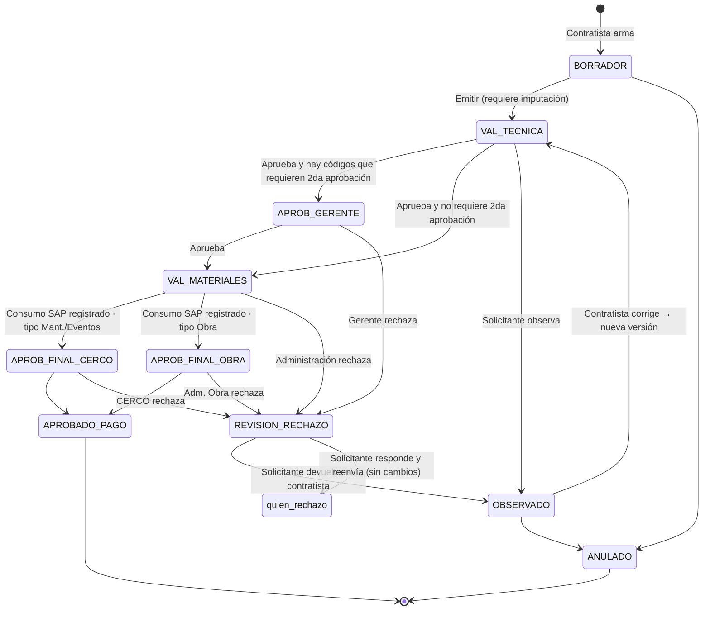

# 03 — Ciclo de vida

Hay **dos ciclos** encadenados:

1. **Tarea** — del pedido a la ejecución terminada.
2. **Certificado** — de la emisión a la aprobación para pago.

Separarlos permite que el circuito de aprobación cambie sin tocar el de ejecución, y deja abierta la posibilidad de varios certificados por tarea (parciales, ver 09).

Lo que sigue es el **flujo estándar** (versión 1). Todo es configurable según 04.

---

## 1. Ciclo de la tarea

```mermaid
stateDiagram-v2
    [*] --> SOLICITADA: Solicitante crea y asigna contratista
    SOLICITADA --> ACEPTADA: Contratista acepta (fecha compromiso)
    SOLICITADA --> SOLICITADA: Contratista rechaza (motivo) → solicitante reasigna
    ACEPTADA --> EN_EJECUCION: Contratista inicia
    EN_EJECUCION --> EJECUTADA: Contratista informa fin
    EJECUTADA --> EN_CERTIFICACION: Contratista emite certificado
    EN_CERTIFICACION --> CERTIFICADA: Certificado aprobado para pago
    SOLICITADA --> CANCELADA: Solicitante / supervisor
    ACEPTADA --> CANCELADA
    EN_EJECUCION --> CANCELADA: requiere motivo; si hubo trabajo, puede certificarse lo ejecutado
    CERTIFICADA --> [*]
    CANCELADA --> [*]
```

### Datos del pedido

- Tipo: **Mantenimiento / Eventos / Obra** (define el aprobador final).
- Título, descripción, ubicación/sitio, región/área.
- Prioridad y **fecha requerida** (base del SLA).
- Contratista asignado.
- Solicitante y su supervisor (automático desde la jerarquía, queda congelado).
- Documentación inicial (fotos, planos, notas).
- Opcional: imputación sugerida, estimación de MO/materiales.

### Reglas

- Mientras la tarea no fue aceptada, el solicitante puede **reasignar** el contratista (con motivo).
- El contratista puede **rechazar** la tarea con motivo; vuelve al solicitante para reasignar.
- Durante la ejecución el contratista puede cargar **avances** (comentarios y fotos) que luego quedan disponibles como documentación del certificado.
- Tarea y contratista intercambian **comentarios** en un hilo propio de la tarea (reemplaza los mails).

---

## 2. Ciclo del certificado

`quien_rechazo` representa "vuelve al mismo paso que rechazó" (APROB_GERENTE, VAL_MATERIALES, etc.).

### Estados

| Estado | Tiene la pelota | Qué hace |
|---|---|---|
| **BORRADOR** | Contratista | Arma carátula, elige imputación, carga MO, materiales y documentos. Guarda cuantas veces quiera. |
| **VAL_TECNICA** | Solicitante | Revisa que el trabajo esté bien hecho y que MO, materiales y recuperados sean correctos. Aprueba u observa. |
| **APROB_GERENTE** | Gerente | 2da aprobación. Solo si aplica la condición (ver abajo). |
| **VAL_MATERIALES** | Administración (pool) | Valida **solo materiales**. Descarga el reporte, consume en SAP y registra el nº de documento SAP. |
| **APROB_FINAL_CERCO** | CERCO (pool) | Control final: documentación, alcance de códigos, montos. Mant. y Eventos. |
| **APROB_FINAL_OBRA** | Adm. de Obra (pool) | Ídem para Obra. |
| **APROBADO_PAGO** | — | Final. Listo para el proceso de pago. |
| **OBSERVADO** | Contratista | Debe corregir (nueva versión) o anular. |
| **REVISION_RECHAZO** | Solicitante | Un aprobador posterior rechazó; el solicitante decide qué hacer. |
| **ANULADO** | — | Final. Con motivo. |

### Condición de 2da aprobación

El certificado pasa por el gerente si **algún ítem de MO usa un código marcado como "requiere 2da aprobación"** en el catálogo **vigente al momento de la emisión**. La marca se congela en el certificado. Otras condiciones (monto total, tipo de tarea) pueden agregarse por configuración (ver 04).

### Paso de administración (materiales)

1. Administración toma el certificado y descarga el **reporte de materiales** (utilizados y recuperados, con código SAP, UM, cantidades, imputación).
2. Consume en SAP manualmente.
3. Registra en el sistema el **nº de documento SAP** (y fecha). Sin ese dato no puede aprobar.
4. Si los materiales no son correctos, **rechaza** con observaciones por ítem.

---

## 3. Rechazos cruzados

Regla general: **quien rechaza siempre indica motivo**, y puede marcar ítems puntuales (una línea de MO, un material, un documento faltante).

| Quién rechaza | Va a | Opciones del que recibe |
|---|---|---|
| Solicitante (VAL_TECNICA) | Contratista → OBSERVADO | Corregir (nueva versión) o anular |
| Gerente | Solicitante → REVISION_RECHAZO | a) **Responder y reenviar** al gerente sin cambiar el contenido; b) **Devolver al contratista** |
| Administración | Solicitante → REVISION_RECHAZO | ídem, reenvía a Administración |
| CERCO / Adm. Obra | Solicitante → REVISION_RECHAZO | ídem, reenvía a quien rechazó |

### Reglas clave

- **Reenviar sin cambios** (el solicitante aclara o justifica): el certificado vuelve **directo al paso que rechazó**. Las aprobaciones previas siguen vigentes porque el contenido no cambió.
- **Devolver al contratista**: el contratista crea una **nueva versión**. Al emitirla, **el circuito se reinicia desde VAL_TECNICA** y las aprobaciones de la versión anterior quedan invalidadas (pero visibles en el historial). El sistema muestra a cada aprobador las **diferencias** contra la versión que ya había visto.
- El contratista **ve todas las observaciones** del hilo, de quien sean, para entender por qué vuelve.
- El destino de cada rechazo es configurable por flujo (ej.: que Administración rechace directo al contratista).

### Ejemplo

1. Contratista emite v1 → Solicitante aprueba → Gerente **rechaza**: "el código MO-045 no corresponde al alcance".
2. Solicitante lo ve en REVISION_RECHAZO. Opción A: responde "corresponde por X" y reenvía → vuelve al Gerente. Opción B: lo devuelve al contratista.
3. En B, el contratista corrige y emite v2 → vuelve a VAL_TECNICA. El solicitante ve el diff v1→v2 y aprueba → Gerente (si v2 sigue requiriéndolo) → etc.

---

## 4. Relación entre ciclos

- La tarea pasa a EN_CERTIFICACION cuando se emite el primer certificado.
- La tarea pasa a CERTIFICADA cuando su certificado queda APROBADO_PAGO.
- Si el certificado se anula, la tarea vuelve a EJECUTADA (puede emitirse otro) o se cancela.

## 5. SLA por paso

Cada estado tiene un **tiempo objetivo** configurable (por tipo de tarea y prioridad). Se mide el tiempo que cada estado estuvo con cada actor. Ver 08.
