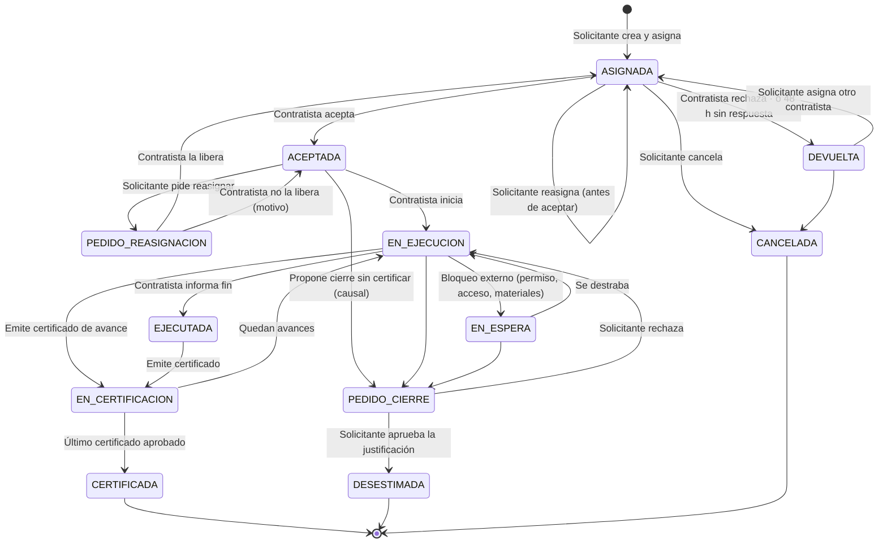
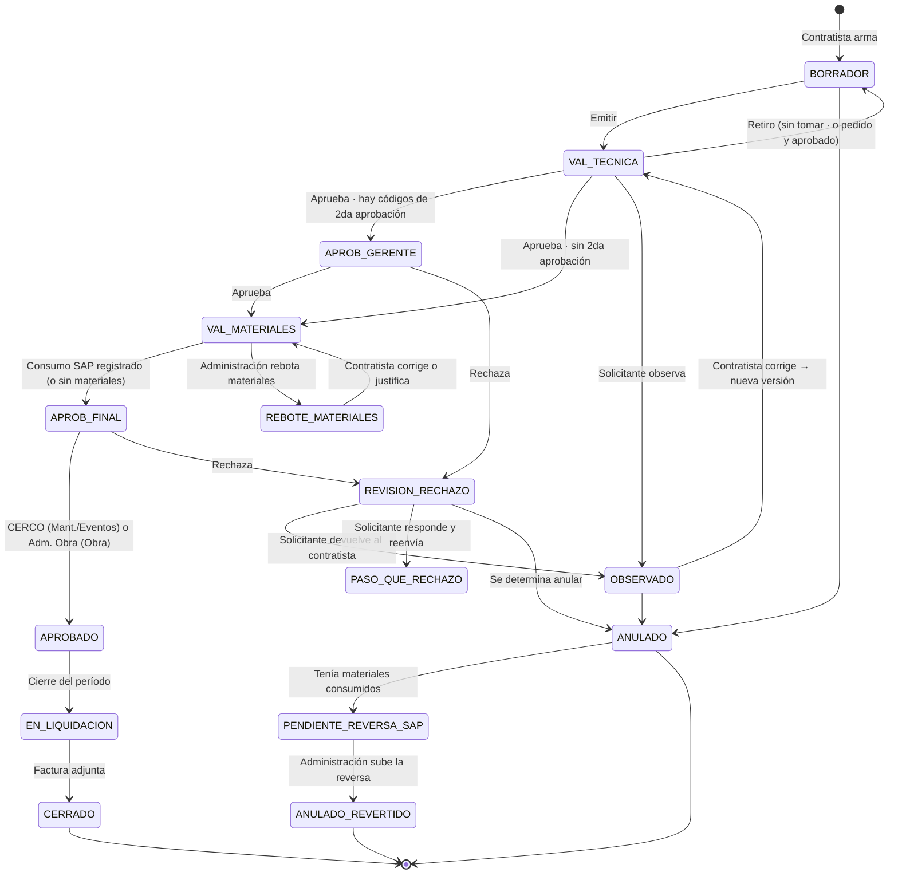
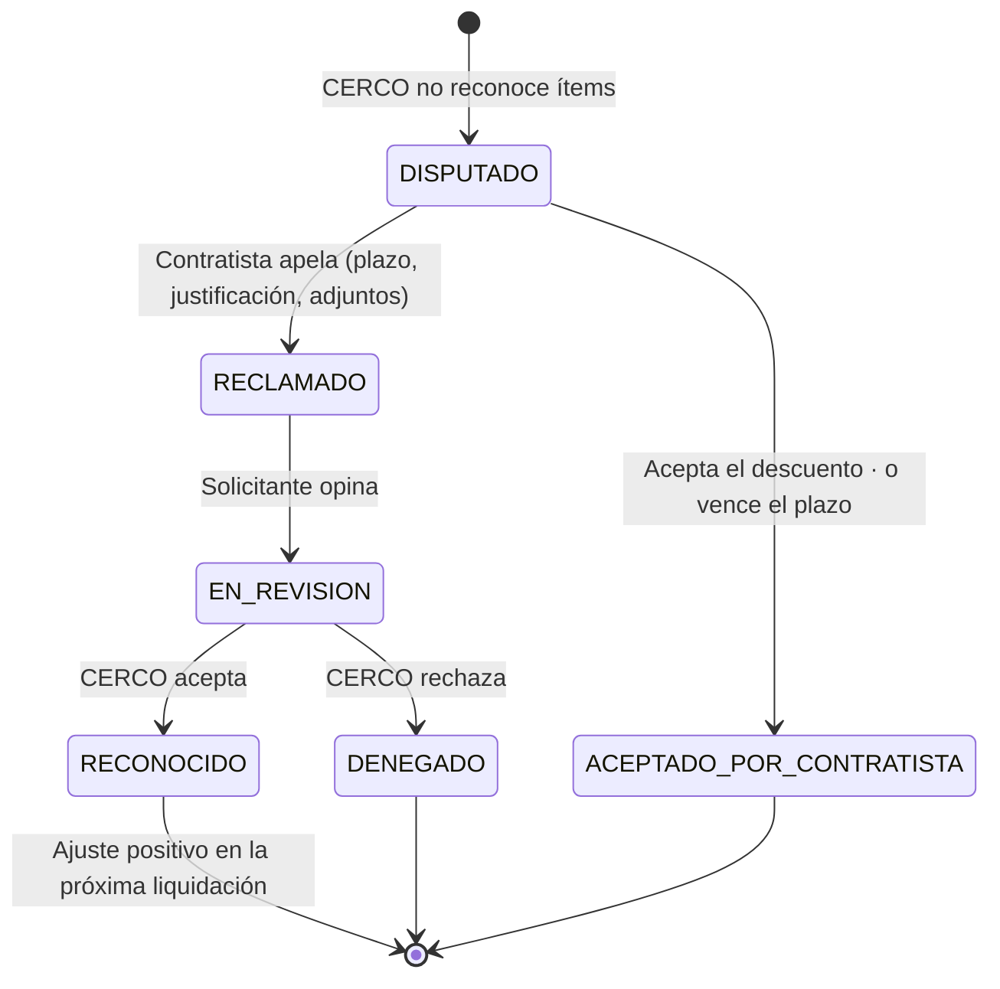

# 03 — Ciclo de vida

Hay **cuatro ciclos** encadenados, todos definidos como flujos configurables (ver 04):

1. **Tarea**: del pedido al fin de la ejecución (o a su desestimación).
2. **Certificado**: de la emisión a la aprobación final. Una tarea puede tener **uno o varios**.
3. **Liquidación**: agrupa certificados aprobados de un **período de pago**, congela precios y se cierra con la factura.
4. **Reclamo**: solo si se habilita la aprobación parcial (§8).

Lo que sigue es el **flujo estándar** (versión 1).

---

## 1. Ciclo de la tarea

### Pedido

Pueden pedir tareas técnicos, inspectores, supervisores y analistas.

| Dato | Nota |
|---|---|
| **Tipo de trabajo** | Mantenimiento / Eventos / Obra. Define la columna de precio, el aprobador final y los campos adicionales |
| Subtipo y campos del tipo | Correctivo, preventivo, siniestro, edificios…; tipo de red, nº de siniestro, proyecto, etapa (ver 05) |
| **Urgencia** | Sí/No. Si es urgencia, **justificación obligatoria** (texto y/o documentos). Solo las tareas marcadas como urgencia pueden certificar el código de urgencia |
| Ubicación | Dirección y/o **coordenada**. La **subregión se asigna sola** según los polígonos (KML) de subregiones; si no cae en ninguno, el solicitante la elige |
| Título, descripción, documentación inicial | |
| Contratista | Entre los habilitados en la subregión |
| **Imputación** | PEP (ARATO), orden de controlling u OT de Helix. Define también el almacén de consumo (proyecto o mantenimiento) |
| Cantidad prevista de certificados | Por defecto 1 (§3) |
| Fecha tentativa | **Opcional e informativa.** No hay fecha compromiso ni plazo de ejecución |
| Presupuesto de la tarea u obra | Solo obras, **interno**: el contratista nunca lo ve |

**Urgencias pedidas por fuera del sistema** (teléfono, WhatsApp): el solicitante carga la tarea igual, aunque el trabajo ya esté hecho o en curso. Se marca la urgencia con su justificación y sigue el ciclo normal (el contratista la acepta y la certifica).

### Tarea múltiple

Si un trabajo necesita varios contratistas (ej. civil + fibra), el solicitante crea una **tarea múltiple** con una **subtarea por contratista** e indica si son:
- **simultáneas**: todas arrancan a la vez;
- **secuenciales**: la subtarea B se habilita recién cuando la A queda EJECUTADA (el contratista B la ve como "en espera de la etapa anterior").

Cada subtarea sigue su propio ciclo y sus certificados. La tarea múltiple consolida estado y costo.

### Asignación y reasignación

| Situación | Regla |
|---|---|
| Asignada, no aceptada | El solicitante puede **reasignar libremente** (con motivo) |
| El contratista la **rechaza** | Vuelve al solicitante (DEVUELTA) y sale de la bandeja del contratista |
| **48 h sin respuesta** | Vuelve sola al solicitante como DEVUELTA (motivo "sin respuesta"). Plazo configurable |
| Ya aceptada | Reasignar requiere que el contratista **acepte liberarla** |
| En ejecución o posterior | No se reasigna |

### Durante la ejecución

- El contratista puede **subasignar** la tarea a sus técnicos o cuadrillas (módulo interno del contratista, ver 02). Los técnicos cargan fotos y observaciones en la **bitácora** de la tarea.
- Tarea y contratista tienen un **hilo de mensajes** propio (reemplaza los mails).
- **EN_ESPERA**: bloqueos externos (permiso municipal, falta de acceso, espera de materiales, clima…), con **causal tipificada**. Mientras dura, **no corre el tiempo del contratista**, pero se registra el **tiempo muerto** para auditoría e indicadores.

### Cierre sin certificar (desestimación)

Todo lo que no termine en "ejecutada con certificado" requiere justificación **aprobada por el solicitante**:
- Causales tipificadas: no se pudo realizar, sin acceso definitivo, duplicada, ya resuelta por otro medio, anulada por el cliente, otra.
- Lo propone el contratista (o el solicitante) con justificación y documentación → el solicitante aprueba → **DESESTIMADA**.
- Si hubo trabajo parcial que corresponde pagar, en vez de desestimar se **certifica lo hecho** y se dan las observaciones que correspondan.

### Trabajo adicional encontrado en campo

El contratista elige:
1. **Ampliación dentro de la misma tarea**: lo certifica en el mismo certificado, con justificación y documentación de quién lo autorizó; el solicitante lo valida en la validación técnica.
2. **Pedido de tarea por ampliación de alcance**: el contratista lo solicita desde la tarea; si el solicitante lo aprueba, se crea una **tarea nueva vinculada** (misma imputación por defecto).

### Otros cambios en la tarea

- **Tipo de trabajo**: el solicitante puede cambiarlo antes o después de certificar. Si ya hay certificados, el cambio queda pendiente de **conformidad del contratista** (se le muestra el impacto en precios) y los certificados no cerrados se revalorizan.
- **Imputación**: la cambian el solicitante o Administración, en su paso, hasta el registro del consumo. Si el cambio afecta el almacén de consumo, puede volver al contratista.
- **Posibles duplicados**: al crear una tarea cercana (zona, tipo y fechas) a otra abierta de otro solicitante, se **alerta al supervisor**, que decide si es duplicado.

---

## 2. Varios certificados por tarea (avances)

- La tarea declara **cuántos certificados se esperan**; se puede aumentar y **reabrir** la tarea con motivo, en cualquier momento.
- Cada certificado se identifica como **"2 de 4"** y se marca si es el **final**.
- La tarea queda CERTIFICADA cuando el certificado final queda aprobado.
- El **avance económico contra presupuesto** (solo obras) es interno.

---

## 3. Ciclo del certificado

### Estados

| Estado | Tiene la pelota | Qué hace |
|---|---|---|
| **BORRADOR** | Contratista (administrativo) | Arma carátula, MO (obligatoria), materiales, recuperados y documentos |
| **VAL_TECNICA** | Solicitante | Valida trabajo, MO, materiales, recuperados, ampliaciones y **suficiencia de la documentación** |
| **APROB_GERENTE** | Gerente de la subregión (o su reemplazo) | 2da aprobación, solo si aplica |
| **VAL_MATERIALES** | Administración (pool) | Valida **solo materiales**; descarga el reporte; consume en SAP; **sube el documento de consumo** (y el de ingreso de recuperados). El sistema compara y alerta diferencias |
| **REBOTE_MATERIALES** | Contratista | Material que SAP no tiene en stock o que no corresponde: el contratista **corrige los materiales o justifica su origen** |
| **APROB_FINAL** | CERCO (Mant./Eventos) o Adm. Obra (Obra) | Control final de **mano de obra**, documentación y alcance. **CERCO no revisa materiales** |
| **APROBADO** | — | Espera el cierre del período |
| **EN_LIQUIDACION** | Contratista | Debe adjuntar la factura |
| **CERRADO** | — | Final. Precio congelado y factura adjunta |
| **OBSERVADO** | Contratista | Corrige (nueva versión) o anula |
| **REVISION_RECHAZO** | Solicitante | Un aprobador posterior rechazó; decide |
| **ANULADO** | — | Final, con motivo |
| **PENDIENTE_REVERSA_SAP** | Administración | Anulado con materiales ya consumidos: hay que revertir en SAP y subir el documento |

### 2da aprobación

Pasa por el gerente si el certificado incluye **algún código marcado "requiere 2da aprobación"** (costo mínimo diario, adicionales, recursos solicitados, etc.). No depende del monto. El gerente es el **de la subregión**; solo si está marcado de vacaciones o no disponible lo toma su reemplazo u otro gerente.

### Rebote de materiales

- Es un ida y vuelta directo **Administración ↔ contratista**, sin pasar por el solicitante (que queda notificado).
- Si el contratista solo cambia **materiales**, la nueva versión **vuelve directo a VAL_MATERIALES**: las aprobaciones de MO siguen valiendo porque la mano de obra no cambió. ⏳ Confirmar si el solicitante debe volver a ver los materiales corregidos.
- Si Administración consumió de más o de menos y lo nota después, lo corrige en SAP y sube el documento de corrección; queda auditado qué pasó y cómo se resolvió.

### Retiro y recuperación

- **Retiro por el contratista**: si nadie tomó el certificado, lo retira y vuelve a BORRADOR. Si el solicitante ya lo tomó, el contratista **pide el retiro** y el solicitante lo aprueba.
- **Recuperar una aprobación**: quien aprobó puede recuperarla, con observación, mientras el paso siguiente no la haya tomado; si ya la tomó, necesita su conformidad. Funciona escalonadamente en cualquier paso.

### Reemplazos y escalamiento

- **Todo usuario tiene un supervisor** que puede **aprobar en su lugar** o reasignar, con causal. Si el supervisor del solicitante aprueba en su lugar, el certificado sigue al gerente (si corresponde) o a Administración.
- **Entre gerentes** pueden tomarse pendientes sin pedir permiso.
- Nadie aprueba **dos pasos** del mismo certificado: se deriva al siguiente en la jerarquía.
- **Ping-pong**: después de N reenvíos sin cambios (configurable) se escala al supervisor.
- **Observados sin corregir**: alertas cuya criticidad sube a medida que se acerca el cierre del período.

---

## 4. Rechazos cruzados

Todo rechazo lleva **motivo tipificado + comentario** y puede marcar **ítems puntuales**.

| Quién rechaza | Va a | Opciones del que recibe |
|---|---|---|
| Solicitante | Contratista → OBSERVADO | Corregir (nueva versión) o anular |
| Administración (materiales) | Contratista → REBOTE_MATERIALES | Corregir materiales o justificar su origen |
| Gerente, CERCO, Adm. Obra | **Solicitante** → REVISION_RECHAZO | a) **Responder y reenviar** sin cambios; b) **devolver al contratista**; c) **anular** |

- **Reenviar sin cambios**: vuelve directo al paso que rechazó; las aprobaciones previas siguen valiendo.
- **Devolver al contratista**: nueva versión; se reinicia desde VAL_TECNICA y cada aprobador ve las **diferencias** contra lo que ya había visto.

---

## 5. Precios

### Fechas de la LPU

Cada LPU tiene **fecha de publicación** (cuando se carga) y **fecha de vigencia** (desde cuándo rige). **Manda la vigencia**: puede ser anterior a la publicación (retroactiva) o posterior (programada).

### Política de precios (configurable)

| Parámetro | Opciones | Valor inicial propuesto |
|---|---|---|
| Fecha de referencia del precio | Emisión (primera versión) · Cierre del período | ⏳ A definir con CERCO |
| Si la LPU nueva **sube** un precio de un certificado no cerrado | Aplicar · No aplicar | Aplicar |
| Si la LPU nueva **baja** un precio de un certificado no cerrado | Aplicar · No aplicar | ⏳ A definir con CERCO |
| LPU retroactiva sobre liquidaciones **ya cerradas** | Generar ajuste · Ignorar | Ignorar |
| Certificado tardío (supera la antigüedad máxima) | Quien autoriza elige: precio de emisión o actualizado | — |

Los ítems de **monto abierto (AD)** no se revalorizan.

Cada certificado guarda el **importe a la emisión**, cada **revalorización** (con la LPU que la causó), el **importe final pagado** y la **diferencia**. La revalorización no pide nuevas aprobaciones, porque las cantidades no cambian.

---

## 6. Liquidación, factura y ajustes

1. En la **fecha de corte** del período, Administración genera la **liquidación**. ⏳ Unidad de liquidación (por contratista, por imputación) a definir.
2. Se **congelan los precios** de los certificados incluidos.
3. El contratista adjunta la **factura**. El sistema puede leerla y **advertir** diferencias, pero **no bloquea** (ver 12).
4. Con la factura, la liquidación y sus certificados quedan **CERRADOS**.
5. Lo aprobado después del corte entra en el período siguiente.

**Ajustes**:
- **Negativos (débitos)**: pagos mal hechos o incumplimientos verificados después del pago. Se cargan como ajuste con motivo y documentación y se descuentan en la liquidación siguiente (el contratista emite la nota de crédito).
- **Positivos**: reclamos reconocidos (§8) o LPU rectificadas.

Lo posterior al cierre (orden de pago, pago efectivo) queda a definir.

---

## 7. Aprobación final: todo o nada, o parcial

Modalidad configurable:
- **Todo o nada** (por defecto).
- **Parcial**: CERCO aprueba excluyendo ítems o reduciendo cantidades, con motivo por ítem; lo no reconocido queda **disputado** (§8).

## 8. Reclamos (solo con aprobación parcial)

---

## 9. Tiempos y SLA

- No hay fechas compromiso. Se miden **tiempos por paso** y se atribuyen al actor que tenía la pelota.
- Los estados de espera externa (EN_ESPERA, "en espera de la etapa anterior") **no cuentan para el contratista**, pero se registran como **tiempo muerto**.
- Plazos configurables: aceptación (48 h), antigüedad máxima para certificar, días para corregir observados, reenvíos antes de escalar. ⏳ Plazo máximo entre EJECUTADA y certificación antes de alertar o desestimar.
- Ver 08.
